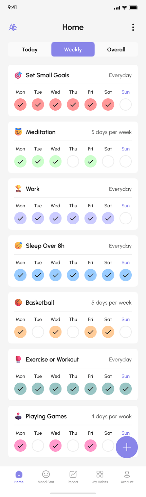
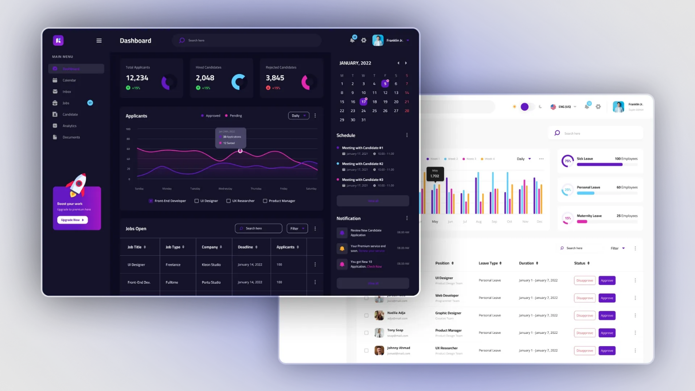

## "Экран мобильного приложения с добавлением анимаций и Экран админ панели на языке Flutter"

Сверстанный красивый экран с Figma под мобильное приложение с анимацией на Curves. 
Реализованый UI админ панели c некоторыми интерактивными элементами.

## Демонстрация работы
[Видео-демонстрация работы экрана с анимациями](https://drive.google.com/file/d/1t73Hs67I3nQ5xT0CtH2O2kKyeU5wUIBD/view?usp=drivesdk)
[Видео-демонстрация работы админ_панели](https://drive.google.com/file/d/1hDhaczXWQnY4F65pLeyY-o9lgSglxzcS/view?usp=sharing)

## Запуск

Если запускаете приложение на телефоне/андроид эмуляторе - откроется экран для мобильного приложения 
Если запускаете приложение на веб эмуляторе - откроется экран админ панели

## Референсы

1. Экран мобильно приложения с Figma 
   **Ссылка на проект:** [Habit_tracker](https://www.figma.com/design/2julsLjXYppArLeNvpEgtt/Habitly---Habit-Tracker-App-UI-Kit--Preview-?node-id=16436-463&p=f&t=7vqnnH6tHce6VnSY-0)

   

2. Экран админ панели 
   **Ссылка на референс:** [Admin_panel](https://avada-media.com/ru/expertise/web-development/admin-panels/)
2. 
   
   